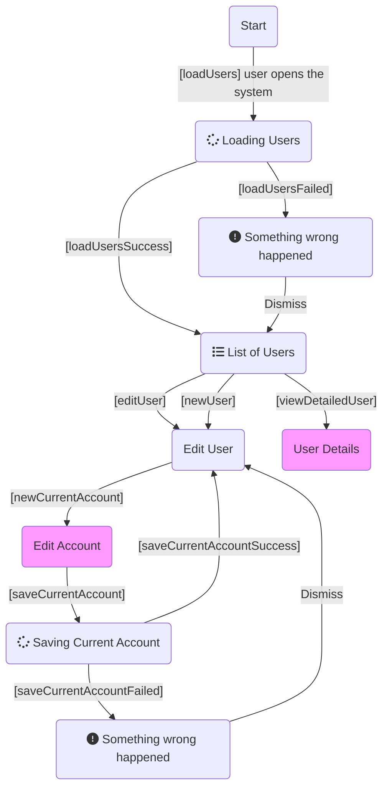

# Bank

**Step by Step**

1. Install the latest version of Docker Desktop.
2. Start Docker Desktop.
3. Clone this Repository.
4. Open a terminal:

```sh
cd <repository folder>
docker-compose up
```

5. Open http://localhost:3000
6. Add a new user 'New User'.
7. Save the user.
8. Select 'Edit'.
9. 'Add Current Account'.
10. Inform some initial credit and save it.
11. View details.
12. A user's details with accounts and transactions are displayed.

## Features

Based on the provided description, the following user flow and stories were derived:



- As a user, I want to see a list of all users available in the system so that I can edit, add, or view user information.
- As a user, I want to add a new account with some initial amount to a given user so that the account becomes the main account, and that given initial amount is the first transaction of that account.
- As a user, I want to view the details of a chosen user (list of accounts, list of transactions, etc.).

## Automated Tests

Integrated and unit tests were provided only to demonstrate knowledge, but they do not cover all possibilities and code.

All tests run as part the build. If you want to access the report generated, run

```sh
docker ps
```

And gets the container name, that could be something like banksample-api-1 and run the copy the result to your local machine. For example, if the container name is sample-api-1 and your local folder is tests:

```sh
docker cp sample-api-1:app/tests ./tests
```

Open the html file generated.

## Architecture & Software Patterns

This section contains a list of common patterns applied:

- Three domains were identified: Users, Accounts, and Transactions, used in both the frontend and backend.
- For enterprise systems, a vertical approach by domain is recommended, as demonstrated here. Further details can be provided in person if necessary.
- On the frontend, the redux approach is used to control the state, along with presentation and container components for domain or non-domain classes. This adheres to the Single Responsibility Principle.
- In the backend, following a Domain Driven Design Approach, the Value Object Current Account could be extracted from User and moved to the Account Domain, along with the Value Object UserId. However, this was left as is to keep the model as simple as possible and with foreign key checks.
- To model the Add Current Account endpoint, a simplified model of the Command pattern from CQRS, a saga pattern idea for long-lived transactions with compensation tasks were employed. In a large and complex system with this design, queues or NoSQL databases would be used, and other feature systems would be involved to meet business requirements.
- Logging was not much invested in for this work
- Exception handling is centralized for simpler code and minimizing bugs.
